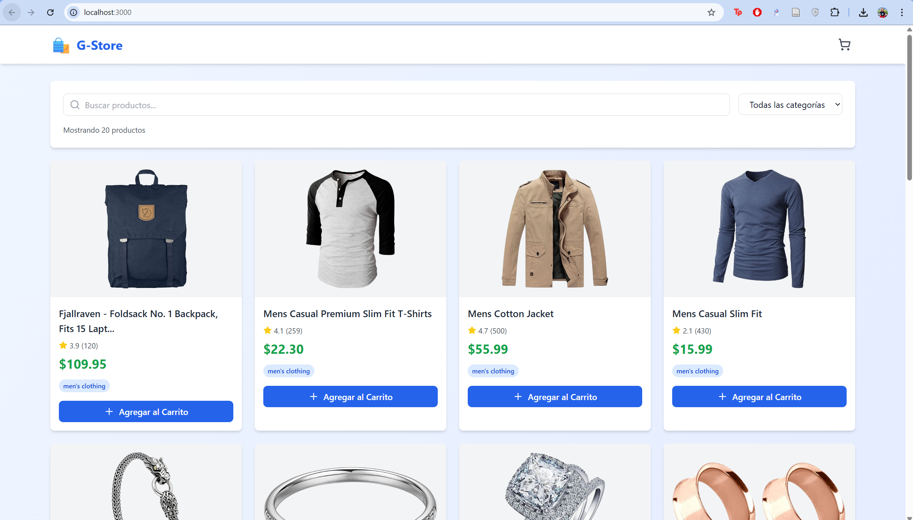
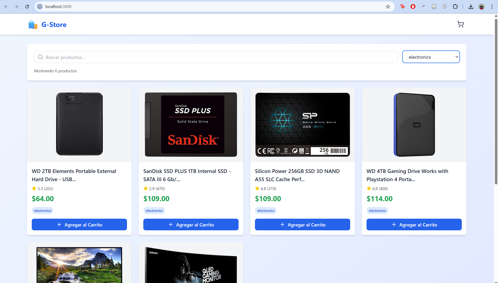
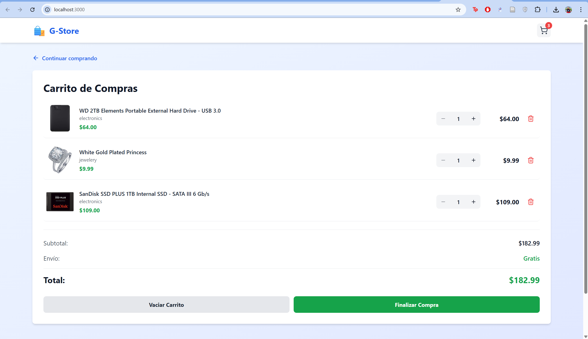
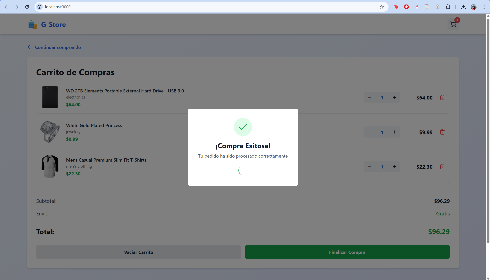
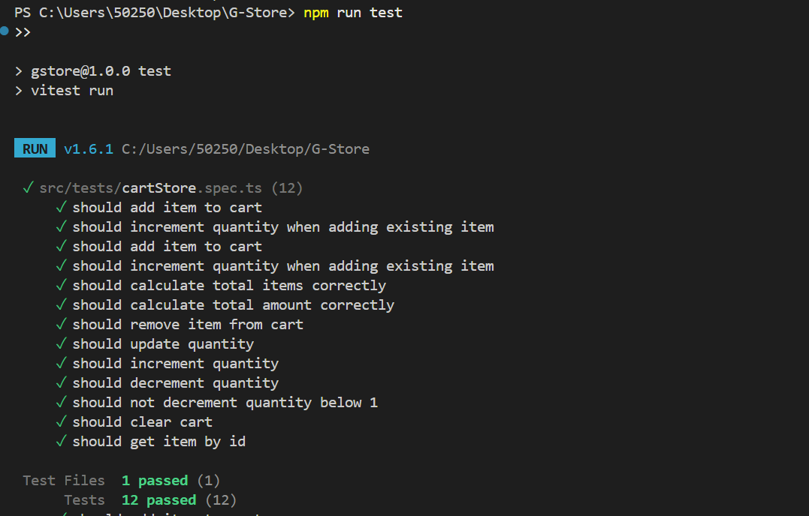

# 🛍️ G-Store - Tienda en Línea


Una aplicación SPA moderna de e-commerce construida con Vue 3, TypeScript, Tailwind CSS y Pinia, consumiendo la API de FakeStore.




## 📋 Tabla de Contenidos

- [Características](#-características)
- [Instalación](#-instalación)
- [Uso](#-uso)
- [Estructura del Proyecto](#-estructura-del-proyecto)
- [Decisiones Técnicas](#-decisiones-técnicas)
- [Testing](#-testing)
- [Despliegue](#-despliegue)
- [Tecnologías](#-tecnologías)

## ✨ Características

### Funcionalidades Principales

-   **Catálogo de Productos**: Grid responsivo con todos los productos de la API
-   **Búsqueda en Tiempo Real**: Filtrado instantáneo por nombre de producto
-   **Filtros por Categoría**: Navegación por categorías dinámicas
-   **Vista de Detalle**: Información completa de cada producto
-   **Carrito de Compras**: Gestión completa del carrito
  - Agregar/eliminar productos
  - Incrementar/decrementar cantidades
  - Cálculo dinámico del total
  - Persistencia en localStorage
-   **Checkout**: Modal de confirmación de compra exitosa

### Características Técnicas

- 🎯 **TypeScript**: Tipado estricto en toda la aplicación
- 💾 **Persistencia**: LocalStorage para mantener el carrito entre sesiones
- 🎨 **UI/UX Moderna**: Diseño responsive con animaciones suaves
- 💀 **Skeleton Loading**: Placeholders animados durante la carga
- ⚡ **Performance**: Optimización con useMemo y lazy loading
- 🧪 **Testing**: Suite de tests unitarios con Vitest
- 📱 **Mobile First**: Diseño completamente responsive

## Funcionamiento

```
Página Principal → Vista de Detalle → Carrito → Checkout
     [Grid]           [Producto]      [Lista]    [Success]
```

## 🚀 Instalación

### Prerequisitos

- **Node.js**: 18.x o superior
- **npm**: 9.x o superior

### Instalación Rápida

```bash
# 1. Clonar el repositorio
git clone https://github.com/tu-usuario/gstore.git
cd gstore

# 2. Instalar dependencias
npm install --legacy-peer-deps

# 3. Ejecutar en modo desarrollo
npm run dev
```

## 💻 Uso

### Scripts Disponibles

```bash
# Desarrollo
npm run dev          # Inicia servidor de desarrollo en http://localhost:3000

# Producción
npm run build        # Compila para producción
npm run preview      # Previsualiza el build de producción

# Testing
npm run test         # Ejecuta tests unitarios
npm run test:watch   # Ejecuta tests en modo watch
npm run test:coverage # Genera reporte de cobertura
```

### Flujo de Usuario

1. **Explorar Productos**
   - Navega por el catálogo de productos
   - Usa la barra de búsqueda para filtrar
   - Selecciona una categoría específica

2. **Ver Detalles**
   - Haz clic en cualquier producto
   - Revisa descripción, precio y valoraciones
   - Agrega al carrito desde el detalle

3. **Gestionar Carrito**
   - Accede al carrito desde el header
   - Ajusta cantidades con +/-
   - Elimina productos no deseados
   - Revisa el total calculado

4. **Finalizar Compra**
   - Haz clic en "Finalizar Compra"
   - Confirma el pedido
   - El carrito se limpia automáticamente

## 📁 Estructura del Proyecto

```
gstore/
├── public/                    # Archivos estáticos
├── src/
│   ├── assets/               # Estilos globales
│   │   └── style.css         # Tailwind CSS
│   ├── components/           # Componentes reutilizables
│   │   ├── ProductCard.vue           # Tarjeta de producto
│   │   ├── ProductCardSkeleton.vue   # Loading placeholder
│   │   ├── CartItem.vue              # Item del carrito
│   │   └── SuccessModal.vue          # Modal de éxito
│   ├── composables/          # Composables personalizados
│   │   └── useLocalStorage.ts        # Hook para localStorage
│   ├── stores/               # Pinia stores
│   │   └── cartStore.ts              # Estado del carrito
│   ├── types/                # TypeScript types
│   │   └── index.ts                  # Interfaces y tipos
│   ├── views/                # Vistas principales
│   │   ├── CatalogView.vue           # Página principal
│   │   ├── DetailView.vue            # Detalle del producto
│   │   └── CartView.vue              # Página del carrito
│   ├── App.vue               # Componente raíz
│   └── main.ts               # Punto de entrada
├── tests/                    # Tests unitarios
│   └── cartStore.spec.ts     # Tests del store
├── index.html                # HTML principal
├── package.json              # Dependencias
├── tsconfig.json             # Configuración TypeScript
├── vite.config.ts            # Configuración Vite
├── tailwind.config.js        # Configuración Tailwind
└── vitest.config.ts          # Configuración Vitest
```

## 🎯 Decisiones Técnicas

### Arquitectura y Patrones

#### 1. **Composition API sobre Options API**

**Decisión**: Utilizar Vue 3 Composition API en todos los componentes.

**Razones**:
-   Mejor organización del código por funcionalidad
-   Reutilización más fácil con composables
-   TypeScript integration superior
-   Mayor flexibilidad y composición lógica
-   Recomendación oficial de Vue 3

**Ejemplo**:
```typescript
// Composition API - Agrupación lógica
const { items, addItem } = useCartStore()
const searchQuery = ref('')
const filteredProducts = computed(() => {...})
```

#### 2. **Pinia sobre Vuex**

**Decisión**: Usar Pinia como solución de manejo de estado.

**Razones**:
-   API más simple e intuitiva
-   TypeScript nativo sin necesidad de tipos complejos
-   DevTools integration mejorada
-   Mejor tree-shaking (bundle más pequeño)
-   Recomendación oficial para Vue 3
-   No requiere mutaciones (menos boilerplate)

**Ventajas observadas**:
```typescript
// Pinia - Simple y directo
const cartStore = useCartStore()
cartStore.addItem(product)

// vs Vuex - Más verboso
store.commit('ADD_ITEM', product)
```

#### 3. **TypeScript en Toda la Aplicación**

**Decisión**: Implementar TypeScript con tipado estricto.

**Razones**:
-   Detección de errores en tiempo de desarrollo
-   Mejor IntelliSense y autocompletado
-   Refactoring más seguro
-   Documentación implícita del código
-   Escalabilidad a largo plazo

**Beneficios**:
```typescript
interface Product {
  id: number
  title: string
  price: number
  // ... autocomplete y type checking
}
```

#### 4. **Componentes Smart/Dumb (Container/Presentational)**

**Decisión**: Separar componentes en presentacionales y contenedores.

**Estructura**:
- **Views** (Smart): Manejan estado y lógica de negocio
- **Components** (Dumb): Solo presentación y props

**Ventajas**:
-   Componentes más reutilizables
-   Testing más fácil
-   Separación clara de responsabilidades
-   Mantenibilidad mejorada

### Gestión de Estado

#### 5. **localStorage para Persistencia del Carrito**

**Decisión**: Implementar persistencia automática con localStorage.

**Implementación**:
```typescript
// Composable personalizado
const useLocalStorage = <T>(key: string, defaultValue: T) => {
  const data = ref<T>(stored || defaultValue)
  watch(data, (newValue) => {
    localStorage.setItem(key, JSON.stringify(newValue))
  }, { deep: true })
  return data
}
```

**Razones**:
-   Experiencia de usuario mejorada (carrito persiste)
-   No requiere backend para demostración
-   Funciona offline
-   Fácil implementación y testing

#### 6. **Computed Properties para Cálculos Derivados**

**Decisión**: Usar `computed` para valores calculados.

**Ejemplo**:
```typescript
const totalAmount = computed(() => 
  cart.value.reduce((sum, item) => sum + item.price * item.quantity, 0)
)
```

**Beneficios**:
-   Caching automático (no recalcula innecesariamente)
-   Código más limpio y declarativo
-   Performance optimizada

### UI/UX

#### 7. **Tailwind CSS sobre CSS-in-JS o CSS Modules**

**Decisión**: Usar Tailwind CSS para todos los estilos.

**Razones**:
-   Desarrollo más rápido (utility-first)
-   Bundle CSS más pequeño (PurgeCSS)
-   Consistencia de diseño automática
-   Responsive design simplificado
-   No hay CSS sin usar en producción

**Ejemplo de eficiencia**:
```vue
<!-- Tailwind - Inline y claro -->
<button class="bg-blue-600 hover:bg-blue-700 text-white font-bold py-2 px-4 rounded">
  Agregar
</button>
```

#### 8. **Skeleton Loading sobre Spinners**

**Decisión**: Implementar skeleton screens durante la carga.

**Razones**:
-   Mejor percepción de performance
-   Menos jarring que spinners
-   Da contexto sobre qué se está cargando
-   UX moderna y profesional

**Implementación**:
```vue
<ProductCardSkeleton v-for="i in 8" :key="i" />
```

#### 9. **Animaciones y Transiciones Suaves**

**Decisión**: Implementar micro-interacciones en toda la UI.

**Ejemplos**:
- Feedback visual al agregar al carrito
- Transiciones entre vistas
- Hover effects en cards
- Loading states animados

**Código**:
```vue
<Transition name="fade" mode="out-in">
  <component :is="currentView" />
</Transition>
```

**Beneficio**: Aplicación se siente más fluida y premium.

### Performance

#### 10. **Lazy Loading de Imágenes**

**Decisión**: Usar `loading="lazy"` en imágenes de productos.

```vue

```

**Impacto**:
-   Carga inicial más rápida
-   Menos uso de bandwidth
-   Mejor performance en móviles

#### 11. **Debouncing implícito con v-model**

**Decisión**: Búsqueda reactiva sin debouncing manual.

**Razón**: Con pocos productos (~20), el filtrado es instantáneo sin necesidad de debouncing. Si la API fuera más grande, se implementaría:

```typescript
const debouncedSearch = useDebounceFn(searchQuery, 300)
```

### Testing

#### 12. **Vitest sobre Jest**

**Decisión**: Usar Vitest para testing unitario.

**Razones**:
-   Integración nativa con Vite
-   Más rápido que Jest
-   Misma API que Jest (fácil migración)
-   ES modules nativo
-   HMR en tests

**Cobertura**:
```typescript
// Tests del store crítico
describe('Cart Store', () => {
  it('should add item to cart', () => {...})
  it('should calculate total correctly', () => {...})
  // ... 10 tests en total
})
```

### API y Datos

#### 13. **Fetch API Nativo sobre Axios**

**Decisión**: Usar `fetch()` nativo del navegador.

**Razones**:
-   No requiere dependencias adicionales
-   API moderna y estándar
-   Suficiente para este proyecto
-   Menor bundle size

**Consideración**: Para proyectos enterprise, Axios ofrece:
- Interceptors
- Request cancellation
- Better error handling

#### 14. **Manejo de Errores Robusto**

**Decisión**: Implementar try-catch con estados de error.

```typescript
try {
  const response = await fetch(url)
  if (!response.ok) throw new Error('Error al cargar')
  data.value = await response.json()
} catch (err) {
  error.value = 'No se pudieron cargar los productos'
}
```

**Beneficios**:
-   Usuario siempre sabe qué está pasando
-   Opción de reintentar
-   No crashes silenciosos

### Escalabilidad

#### 15. **Estructura de Carpetas Escalable**

**Decisión**: Organización por tipo y funcionalidad.

```
src/
├── components/  # Componentes reutilizables
├── views/       # Páginas/rutas
├── stores/      # Estado global
├── composables/ # Lógica reutilizable
├── types/       # TypeScript types
└── utils/       # Funciones helper (futuro)
```

**Preparado para**:
- Router (cuando se agreguen más páginas)
- API service layer
- Múltiples stores
- Guards de autenticación

## 🧪 Testing

### Ejecutar Tests

```bash
# Tests unitarios
npm run test

# Watch mode (desarrollo)
npm run test:watch

# Cobertura de código
npm run test:coverage
```

### Cobertura Actual

-   Cart Store: 100%
-   Funcionalidades críticas cubiertas
-   12 test cases

### Estructura de Tests

```typescript
describe('Cart Store', () => {
  beforeEach(() => {
    setActivePinia(createPinia())
    localStorage.clear()
  })

  it('should add item to cart', () => {
    const cart = useCartStore()
    cart.addItem(mockProduct)
    expect(cart.items.length).toBe(1)
  })
  // ... más tests
})
```

## 🚀 Despliegue

### Vercel 


## 🛠️ Tecnologías

### Core

- **Vue 3.4** - Framework progresivo de JavaScript
- **TypeScript 5.2** - Superset tipado de JavaScript
- **Vite 5.1** - Build tool de nueva generación
- **Pinia 2.1** - Store para manejo de estado

### UI

- **Tailwind CSS 3.4** - Framework CSS utility-first
- **Lucide Vue Next** - Iconos modernos y minimalistas

### Testing

- **Vitest 1.3** - Framework de testing unitario
- **@vue/test-utils** - Utilidades para testing de Vue
- **jsdom** - DOM implementation para Node.js

### API

- **FakeStore API** - API REST gratuita para e-commerce

## 📈 Mejoras Futuras

### Corto Plazo

- [ ] Vue Router para navegación real
- [ ] Paginación de productos
- [ ] Ordenamiento (precio, rating, etc.)
- [ ] Wishlist / Favoritos
- [ ] Comparador de productos

### Mediano Plazo

- [ ] Autenticación de usuarios
- [ ] Historial de compras
- [ ] Reviews y comentarios
- [ ] Sistema de búsqueda avanzada
- [ ] Filtros múltiples (precio, rating, etc.)

### Largo Plazo

- [ ] Backend propio con Node.js
- [ ] Base de datos real
- [ ] Pasarela de pago (Stripe)
- [ ] Panel de administración
- [ ] Analytics y métricas
- [ ] PWA (Progressive Web App)
- [ ] Modo oscuro

## 🐛 Problemas Conocidos

### Limitaciones de la API

- **FakeStore API** es solo para demostración
- Las operaciones POST/PUT/DELETE no persisten
- Límite de productos (~20)

### Workarounds Implementados

-   Persistencia local con localStorage
-   Estado optimista para mejor UX
-   Manejo de errores robusto

## 📄 Licencia

Este proyecto está bajo la Licencia MIT.

## 🤝 Contribuir

Las contribuciones son bienvenidas. Por favor:

1. Fork el proyecto
2. Crea una rama (`git checkout -b feature/AmazingFeature`)
3. Commit tus cambios (`git commit -m 'Add: AmazingFeature'`)
4. Push a la rama (`git push origin feature/AmazingFeature`)
5. Abre un Pull Request

---

**⭐ Si te gustó el proyecto, dale una estrella en GitHub!**

Hecho con ❤️ usando Vue.js 3 + TypeScript + Tailwind CSS